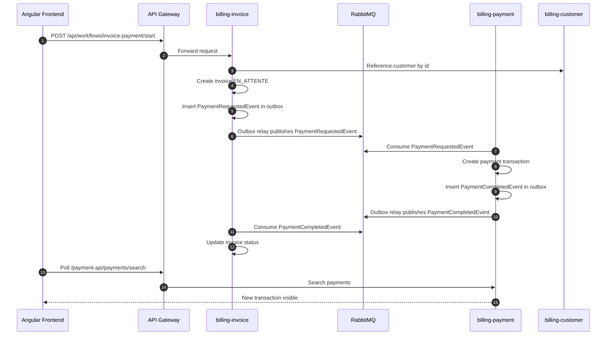

# Bank Transfer & Invoice Payment Management System

Plateforme microservices pour la gestion de factures, creanciers, points de vente, customers et paiements.

Le projet combine Spring Boot, Angular, RabbitMQ, Camunda, PostgreSQL, Vault, JasperReports, Apache Camel et une API Gateway.

## Architecture

```text
Angular Frontend
       |
       v
API Gateway :8085
       |
       +--> billing-invoice  :8080
       |      - factures
       |      - creanciers
       |      - points de vente
       |      - workflow Camunda
       |      - export PDF JasperReports
       |      - events RabbitMQ
       |
       +--> billing-payment  :8082
       |      - transactions payment
       |      - listener PaymentRequestedEvent
       |      - publisher PaymentCompletedEvent
       |
       +--> billing-customer :8083
              - referentiel customers

RabbitMQ
  - communication asynchrone invoice/payment

Vault
  - stockage centralise des secrets backend

PostgreSQL
  - schemas invoice, payment, customer
```

## Stack technique

- Frontend : Angular, Ng Zorro, RxJS.
- API Gateway : Spring Cloud Gateway.
- Backend : Spring Boot 3.5, Spring Data JPA, Spring Security Resource Server.
- Workflow : Camunda BPM.
- Messaging : RabbitMQ.
- Reporting : JasperReports.
- Integration : Apache Camel.
- Base de donnees : PostgreSQL.
- Secrets : HashiCorp Vault.
- Build : Maven, Maven Wrapper quand disponible, npm.

## Nouveautes ajoutees

### API Gateway

Un microservice `api-gateway` centralise maintenant les appels frontend.

Routes principales :

```text
/api/**          -> billing-invoice
/customer-api/** -> billing-customer
/payment-api/**  -> billing-payment
```

La gateway ecoute sur :

```text
http://localhost:8085
```

Le frontend Angular utilise cette gateway via `proxy.conf.json`.

Regle frontend :

- Angular appelle uniquement la gateway avec des URLs relatives :
  - `/api/**`
  - `/customer-api/**`
  - `/payment-api/**`
- `proxy.conf.json` pointe ces chemins vers `http://localhost:8085`.
- Aucun appel frontend ne doit cibler directement `billing-invoice:8080`, `billing-payment:8082` ou `billing-customer:8083`.

### Swagger/OpenAPI et health checks

Les endpoints de supervision publics sont disponibles sans token :

```text
GET /actuator/health
GET /v3/api-docs
GET /swagger-ui.html
```

Depuis la gateway :

```text
Gateway Swagger  : http://localhost:8085/swagger-ui.html
Gateway health   : http://localhost:8085/actuator/health
Customer OpenAPI : http://localhost:8085/customer-docs/v3/api-docs
Invoice OpenAPI  : http://localhost:8085/invoice-docs/v3/api-docs
Payment OpenAPI  : http://localhost:8085/payment-docs/v3/api-docs
```

Les microservices exposent aussi leurs propres Swagger/health en direct pour diagnostic local :

```text
http://localhost:8083/swagger-ui.html
http://localhost:8080/swagger-ui.html
http://localhost:8082/swagger-ui.html
```

### Securite Camunda

Les endpoints Camunda ne sont plus publics :

```text
/camunda/**
/engine-rest/**
```

Ils passent par la securite Spring Resource Server et necessitent donc un token JWT valide.

### Controle de roles

Les microservices lisent les roles Keycloak depuis `realm_access.roles`.

Roles metier :

```text
admin              : acces complet
agent_facturation  : factures, creanciers, points de vente, workflows
agent_paiement     : transactions payment
lecteur            : consultation seule
```

Le realm Docker declare ces roles et donne le role `admin` a l'utilisateur `admin`.

Important : si Keycloak existe deja avec un volume persistant, le fichier d'import ne sera pas rejoue automatiquement. Dans ce cas, creer les roles ci-dessus dans Keycloak et affecter au moins `admin` a l'utilisateur d'administration.

### RabbitMQ idempotent et DLQ

Les consommateurs RabbitMQ enregistrent les `eventId` deja traites dans une table `processed_message`.

Objectifs :

- ignorer proprement un message rejoue par RabbitMQ ;
- eviter de creer deux paiements pour le meme `PaymentRequestedEvent` ;
- eviter de mettre deux fois a jour une facture pour le meme `PaymentCompletedEvent`.

Les listeners utilisent aussi un retry applicatif :

```text
3 tentatives -> backoff progressif -> DLQ
```

Queues DLQ :

```text
payment.requested.dlq
invoice.payment.completed.dlq
```

### Transactional Outbox

Les evenements metier ne sont plus envoyes directement a RabbitMQ depuis la transaction principale.

Principe :

```text
transaction metier
  -> sauvegarde facture/paiement
  -> insertion outbox_event
  -> commit DB
  -> relay planifie publie vers RabbitMQ
  -> published_at renseigne
```

Tables ajoutees par Flyway :

```text
invoice.outbox_event
payment.outbox_event
```

Objectifs :

- eviter de perdre un evenement si RabbitMQ est indisponible pendant une creation/metier ;
- rejouer automatiquement les evenements non publies ;
- garder une trace `trace_id` / `span_id` de l'appel qui a cree l'evenement ;
- publier `PaymentRequestedEvent` et `PaymentCompletedEvent` de maniere plus fiable.

Le relay outbox tourne toutes les `2s` par defaut :

```text
billing.outbox.relay-delay-ms=2000
```

### Tracabilite distribuee Micrometer Tracing + Zipkin

Les microservices et la gateway utilisent Micrometer Tracing avec Brave et exportent les traces vers Zipkin.

Docker Compose ajoute :

```text
Zipkin UI : http://localhost:9411
```

Variable configuree via Vault ou environnement :

```text
ZIPKIN_ENDPOINT=http://zipkin:9411/api/v2/spans
```

En local hors Docker, le fallback est :

```text
http://localhost:9411/api/v2/spans
```

Les traces permettent de suivre un parcours complet :

```text
frontend -> api-gateway -> billing-invoice -> outbox -> RabbitMQ -> billing-payment -> outbox -> RabbitMQ -> billing-invoice
```

### Vault

HashiCorp Vault a ete integre pour sortir les secrets des fichiers de configuration.

Objectifs :

- ne plus mettre les mots de passe en clair dans les `application.yaml` ;
- centraliser les secrets ;
- faciliter le changement de credentials sans modifier le code ;
- garder une configuration plus propre pour PostgreSQL, RabbitMQ et Keycloak.

Secrets attendus :

```text
DB_URL
DB_USERNAME
DB_PASSWORD
KEYCLOAK_ISSUER_URI
ZIPKIN_ENDPOINT
RABBITMQ_HOST
RABBITMQ_PORT
RABBITMQ_USERNAME
RABBITMQ_PASSWORD
```

Script de chargement :

```powershell
.\scripts\vault-put-secrets.ps1
```

Chemin Vault utilise :

```text
secret/application
```

### Secrets Docker Compose

Les secrets ne sont plus ecrits en clair dans `docker-compose.yml`.

Le compose lit maintenant les valeurs depuis des variables d'environnement ou depuis un fichier `.env` local non versionne.

Fichier modele :

```text
.env.example
```

Creation locale :

```powershell
Copy-Item .env.example .env
```

Puis remplacer les valeurs `change_me` dans `.env`.

Variables attendues :

```text
POSTGRES_DB
POSTGRES_USER
POSTGRES_PASSWORD
RABBITMQ_DEFAULT_USER
RABBITMQ_DEFAULT_PASS
VAULT_DEV_ROOT_TOKEN_ID
KEYCLOAK_ADMIN
KEYCLOAK_ADMIN_PASSWORD
KEYCLOAK_ISSUER_URI
```

Le fichier `.env` est ignore par Git. Seul `.env.example` doit etre versionne.

### Frontend responsive

Le frontend Angular a ete ameliore pour mieux fonctionner sur desktop et mobile :

- sidebar desktop ;
- navigation mobile ;
- tableaux avec scroll horizontal controle ;
- colonnes longues mieux gerees ;
- meilleur affichage des dates, emails, ICE, references et montants ;
- layout plus stable sur petits ecrans.

### Dashboard

Une page dashboard a ete ajoutee comme page d'accueil.

Elle donne un acces rapide aux principales rubriques :

- factures ;
- creanciers ;
- points de vente ;
- test paiement ;
- transactions recentes.

### Factures

Ameliorations ajoutees :

- page liste des factures ;
- page detail facture `/factures/:id` ;
- endpoint backend `GET /api/invoices/{id}` ;
- timeline detail facture :
  - facture creee ;
  - facture validee ;
  - paiement demande ;
  - paiement reussi ou echoue ;
- export CSV des factures ;
- export Excel des factures ;
- numerotation automatique des references facture dans la page de test paiement ;
- affichage des vrais noms au lieu des IDs seuls :
  - customer ;
  - creancier ;
  - point de vente ;
- suivi simple de l'etat facture/paiement ;
- tri serveur ;
- pagination serveur ;
- etat de table conserve dans l'URL.

Exemple :

```text
/factures?page=2&size=20&sortBy=createdDate&sortOrder=descend
```

### Creanciers

Ameliorations ajoutees :

- CRUD complet ;
- recherche multi-criteres ;
- pagination serveur ;
- tri serveur ;
- notifications toast ;
- conservation de l'etat de table dans l'URL.

Colonnes triables :

- ID ;
- nom ;
- type ;
- ICE ;
- banque ;
- email ;
- telephone ;
- date creation.

### Points de vente

Ameliorations ajoutees :

- CRUD complet ;
- recherche multi-criteres ;
- export PDF ;
- pagination serveur ;
- tri serveur ;
- correction du backend pour respecter le parametre `size` ;
- notifications toast ;
- conservation de l'etat de table dans l'URL.

Colonnes triables :

- ID ;
- nom ;
- adresse ;
- telephone.

### Transactions payment

Ameliorations ajoutees :

- affichage des vrais noms customer, creancier et point de vente ;
- mode de paiement affiche correctement ;
- date creation affichee ;
- pagination serveur ;
- tri serveur ;
- conservation de l'etat de table dans l'URL.

Exemple :

```text
/test-paiement?paymentPage=2&paymentSize=20&paymentSortBy=amount&paymentSortOrder=descend
```

Colonnes triables :

- ID ;
- customer ;
- creancier ;
- point vente ;
- montant ;
- mode ;
- status ;
- date creation.

### Test paiement

La page de test paiement permet de declencher un workflow complet :

1. Creation d'une facture de test.
2. Selection d'un customer depuis le microservice `billing-customer`.
3. Selection d'un creancier.
4. Selection d'un point de vente.
5. Envoi d'un `PaymentRequestedEvent` via RabbitMQ.
6. Creation d'une transaction dans `billing-payment`.
7. Retour d'un `PaymentCompletedEvent`.
8. Mise a jour du statut facture.

Modes autorises :

```text
ESPECES
CARTE
```

### Flyway et donnees de demo

Les schemas PostgreSQL et les donnees de test sont maintenant geres par Flyway.

Schemas geres :

```text
customer -> billing-customer
invoice  -> billing-invoice
payment  -> billing-payment
```

Migrations principales :

```text
billing-customer/src/main/resources/db/migration
  V1__init_customer_schema.sql
  V2__seed_demo_customers.sql

billing-invoice/src/main/resources/db/migration
  V1__init_database.sql
  V2__rename_costumer_to_customer.sql
  V3__add_audit_columns.sql
  V4__seed_demo_invoice_data.sql

billing-payment/src/main/resources/db/migration
  V1__init_payment_schema.sql
  V2__add_payment_status.sql
  V3__seed_demo_transactions.sql
```

Les seeds sont idempotents : ils utilisent des IDs fixes et `ON CONFLICT`, donc relancer les services ne duplique pas les lignes.

Pour reconstruire une base locale :

1. Creer ou vider la base PostgreSQL.
2. Demarrer `billing-customer`.
3. Demarrer `billing-invoice`.
4. Demarrer `billing-payment`.

Flyway cree ou met a jour les tables, ajoute les colonnes necessaires et insere automatiquement les customers, creanciers, points de vente, factures et transactions de demo.

## Flux paiement



## Ports par defaut

```text
api-gateway      : 8085
billing-invoice  : 8080
billing-payment  : 8082
billing-customer : 8083
RabbitMQ AMQP    : 5672
RabbitMQ UI      : 15672
Vault            : 8200
Keycloak         : 8081
Zipkin UI        : 9411
Angular frontend : 4200
```

## Demarrage rapide

### Option A. Tout lancer avec Docker Compose

Le fichier `docker-compose.yml` lance :

- PostgreSQL `db_formation` ;
- RabbitMQ + management UI ;
- Vault dev + injection automatique des secrets ;
- Zipkin pour la tracabilite distribuee ;
- Keycloak avec le realm `billing` et le client `billing-frontend` ;
- `billing-customer` ;
- `billing-invoice` ;
- `billing-payment` ;
- `api-gateway`.

```powershell
docker compose up --build
```

URLs utiles :

```text
Gateway    : http://localhost:8085
Keycloak   : http://localhost:8081
RabbitMQ UI: http://localhost:15672
Vault      : http://localhost:8200
Zipkin     : http://localhost:9411
```

Identifiants dev :

```text
Keycloak admin : admin / admin
Keycloak app   : admin / admin
RabbitMQ       : guest / guest
Vault token    : root
Postgres       : root / moimoimm1
```

### Option B. Lancer en local

Vault local :

```powershell
docker compose up -d vault
```

Charger les secrets :

```powershell
.\scripts\vault-put-secrets.ps1
```

Demarrer les microservices depuis la racine du projet :

```powershell
cd billing-customer
mvn spring-boot:run
```

```powershell
cd ..\billing-payment
.\mvnw.cmd spring-boot:run
```

```powershell
cd ..\billing-invoice
.\mvnw.cmd spring-boot:run
```

```powershell
cd ..\api-gateway
.\mvnw.cmd spring-boot:run
```

### 3. Demarrer le frontend

Le frontend se trouve dans :

```text
billing-invoice-frontend
```

Commandes :

```powershell
billing-invoice-frontend
npm install
npm start
```

Application :

```text
http://localhost:4200
```

## Build et verification

Frontend :

```powershell
npm run build
```

Microservice invoice :

```powershell
cd billing-invoice
.\mvnw.cmd -q -DskipTests compile
```

Microservice payment :

```powershell
cd billing-payment
.\mvnw.cmd -q -DskipTests compile
```

API Gateway :

```powershell
cd api-gateway
.\mvnw.cmd -q -DskipTests compile
```

## Endpoints principaux

### Gateway

```text
GET http://localhost:8085/actuator/health
```

### Invoice

```text
GET  /api/invoices/search
GET  /api/invoices/{id}
GET  /api/invoices/{id}/export/pdf
POST /api/workflows/invoice-payment/start
GET  /api/creanciers/search
GET  /api/points-de-vente/search
```

### Customer

```text
GET /customer-api/customers/search
```

### Payment

```text
GET /payment-api/payments/search
GET /payment-api/payments/{id}
GET /payment-api/payments/{id}/attempts
GET /payment-api/payments/dashboard
POST /payment-api/payments/{id}/retry
```

Fonctionnalites payment cote interface :

- Page detail transaction payment depuis `/paiements/{id}`.
- Lien facture -> transaction dans le detail facture.
- Lien transaction -> facture dans les listes payment.
- Retry d'un paiement echoue depuis le detail transaction et la liste des transactions.
- Historique des tentatives de paiement par facture ou transaction parent.
- Dashboard paiement : total encaisse, transactions echouees, repartition CARTE / ESPECES.

## Parametres de pagination et tri

Les endpoints de recherche acceptent :

```text
page
size
sortBy
sortDir
```

Exemple :

```text
/api/invoices/search?page=0&size=20&sortBy=createdDate&sortDir=desc
```

## Notes importantes

- Les customers doivent venir du microservice `billing-customer`.
- Les transactions doivent venir du microservice `billing-payment`.
- Les factures, creanciers et points de vente viennent du microservice `billing-invoice`.
- Le microservice payment ne doit pas utiliser une table customer locale comme source de verite.
- RabbitMQ peut rejouer des anciens messages ; les `eventId` traites sont maintenant stockes pour rendre les listeners idempotents.
- Vault est utilise par les backends, pas directement par Angular.

## Licence

Projet de formation.
