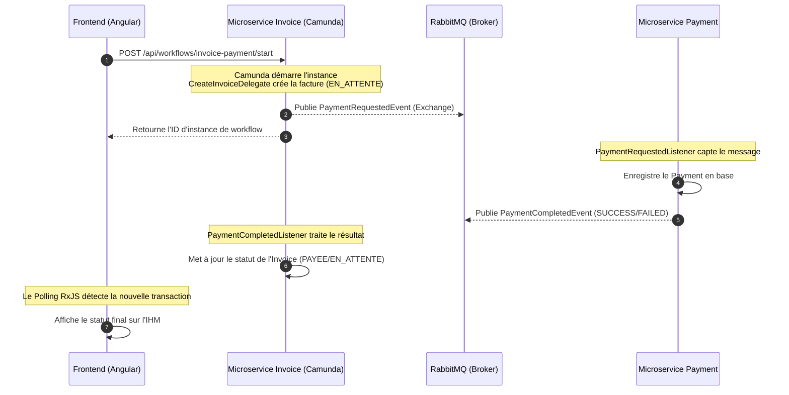

# 🏦 Bank Transfer & Invoice Payment Management System

Une plateforme moderne d'entreprise pour la **gestion de facturation, d'encaissement et de paiement de factures**. Ce projet est construit sur une architecture microservices hautement découplée et résiliente, s'appuyant sur des technologies de premier plan telles que **Spring Boot**, **Camunda BPM**, **RabbitMQ**, **Apache Camel**, **JasperReports** et un frontend dynamique en **Angular**.

---

## 🏗️ Architecture Globale & Technologies

L'application est découpée en **3 microservices indépendants** et **1 client riche (Frontend)** :

```
┌────────────────────────────────────────────────────────────────────────┐
│                      BILLING-INVOICE-FRONTEND (Angular)                │
└──────────────────────────────────┬─────────────────────────────────────┘
                                   │ (REST API & Auth)
                                   ▼
┌────────────────────────────────────────────────────────────────────────┐
│                       BILLING-INVOICE (Microservice)                   │
│   - Gestion des Factures, Créanciers & Points de Vente                  │
│   - Orchestration des processus métier (Camunda BPM 7)                 │
│   - Exportation de données en temps réel (Apache Camel)                │
│   - Génération de rapports PDF (JasperReports)                         │
└─────────────────┬──────────────────────────────────────▲───────────────┘
                  │ (PaymentRequestedEvent)              │ (PaymentCompletedEvent)
                  ▼                                      │
          ┌───────────────┐                      ┌───────┴───────┐
          │   RabbitMQ    ├─────────────────────►│   RabbitMQ    │
          │   Exchange    │                      │     Queue     │
          └───────┬───────┘                      └───────▲───────┘
                  │                                      │
                  └────────────────► ┌───────────────────┴───────────┐
                                     │   BILLING-PAYMENT (Microservice)  │
                                     │   - Enregistrement des Paiements  │
                                     │   - Simulation de Transactions    │
                                     └───────────────────────────────┘
                                                     ▲
                                                     │ (REST Search)
                                     ┌───────────────┴───────────────┐
                                     │  BILLING-CUSTOMER (Microservice)│
                                     │   - Référentiel des Clients   │
                                     └───────────────────────────────┘
```

### 🛠️ Stack Technique

*   **Frontend :** Angular 18+, Ng-Zorro Ant Design (UI), RxJS.
*   **Backend (Microservices) :** Spring Boot 3.5+, Spring Data JPA, Spring Security (OAuth2 Resource Server), Spring Cloud Config.
*   **Workflow Engine :** Camunda BPM 7.24 (Webapp Cockpit/Tasklist intégrée).
*   **Message Broker :** RabbitMQ (AMQP) pour la communication asynchrone et événementielle.
*   **Intégration de Flux :** Apache Camel 4 pour l'export automatisé de fichiers JSON.
*   **Reporting :** JasperReports 6 pour l'export de rapports PDF professionnels.
*   **Base de Données :** PostgreSQL (Production/Dev), H2 (Tests/Dev rapide) & Flyway pour le versioning de base de données.
*   **Cache :** Spring Cache avec gestion automatisée du cycle de vie des données.

---

## 🌟 Fonctionnalités Clés

### 1. Gestion des Créanciers (CRUD complet)
*   Enregistrement et édition des organismes émetteurs de factures (Télécoms, Électricité, Administrations).
*   Suivi des informations d'identité commerciale : Nom, Type de Créancier, Identifiant Commun de l'Entreprise (ICE), Registre du Commerce (RC), RIB, Banque et coordonnées complètes.

### 2. Gestion des Points de Vente (Héritage Single Table JPA)
*   Gestion unifiée des canaux d'encaissement physique ou numérique avec distinctions métier :
    *   **Agences :** avec Code agence, Nom du responsable, Région et Type d'agence.
    *   **Distributeurs :** avec Code distributeur, Zone géographique, Nom commercial et Taux de commission de transaction.
*   **Optimisation des performances :** Cache applicatif Spring Cache implémenté pour éliminer les requêtes DB redondantes sur les points de vente.
*   **Export Camel Automatique :** Chaque création de point de vente déclenche une route Camel qui exporte la fiche au format JSON cryptique dans le dossier local `exports/points-de-vente`.
*   **Export PDF JasperReports :** Export instantané d'un rapport PDF professionnel regroupant les points de vente filtrés.

### 3. Orchestration & Traitement Événementiel des Paiements
*   **Workflow Camunda BPM :** Cycle de vie de la facture entièrement modélisé (`invoice-payment-process.bpmn`).
*   **Couplage Faible (RabbitMQ) :**
    1.  Le workflow valide la facture et publie un événement `PaymentRequestedEvent` sur RabbitMQ.
    2.  Le microservice `billing-payment` consomme l'événement, exécute la transaction financière et enregistre le paiement.
    3.  Un événement `PaymentCompletedEvent` est publié en retour.
    4.  Le service de facturation met à jour le statut de la facture à `PAYEE` ou la remet `EN_ATTENTE`.

### 4. Interface Interactive de Simulation
*   Interface Angular dédiée pour émettre une facture de test à la volée.
*   Sélection dynamique du Client, Créancier et Point de Vente.
*   Simulation asynchrone du succès ou de l'échec d'une transaction, avec actualisation en temps réel de l'état du paiement à l'écran sans rafraîchir la page (polling intelligent RxJS).

---

## 🔄 Flux Transactionnel (Détail Technique)



---

## 🚀 Guide de Démarrage Rapide

### Prérequis
*   **Java 17** ou supérieur.
*   **Node.js 18+** et **Angular CLI 18+**.
*   **Maven** 3.8+.
*   **Docker** (pour exécuter RabbitMQ et PostgreSQL facilement) ou des instances locales installées.

---

### Étape 1 : Lancer l'infrastructure (RabbitMQ & Base de données)
Si vous disposez de Docker, vous pouvez exécuter un conteneur RabbitMQ en arrière-plan :
```bash
docker run -d --name rabbitmq -p 5672:5672 -p 15672:15672 rabbitmq:3-management
```
*L'interface d'administration de RabbitMQ sera disponible sur http://localhost:15672 (identifiants par défaut : `guest` / `guest`).*

---

### Étape 2 : Configurer et démarrer les Microservices
Chaque microservice Spring Boot est indépendant et dispose de son fichier de configuration `application.yaml` sous `src/main/resources`.

1.  **Démarrer le service Client (`billing-customer`) :**
    ```bash
    cd billing-customer
    mvn spring-boot:run
    ```
2.  **Démarrer le service Paiement (`billing-payment`) :**
    ```bash
    cd ../billing-payment
    mvn spring-boot:run
    ```
3.  **Démarrer le service Facturation (`billing-invoice`) :**
    ```bash
    cd ../billing-invoice
    mvn spring-boot:run
    ```

*Le service de facturation embarque également le moteur Camunda. La console Camunda Cockpit est accessible à l'adresse http://localhost:8081/camunda.*

---

### Étape 3 : Démarrer le Frontend Angular (`billing-invoice-frontend`)
1.  Accédez au répertoire du frontend et installez les dépendances :
    ```bash
    cd ../billing-invoice-frontend
    npm install
    ```
2.  Lancez le serveur de développement :
    ```bash
    npm run start
    ```
3.  Ouvrez votre navigateur sur **http://localhost:4200**.

---

## 🧪 Simulation d'un Scénario de Test
1.  Rendez-vous sur l'onglet **Créanciers** pour ajouter un émetteur ou vérifier la liste.
2.  Allez sur l'onglet **Points de vente** pour ajouter une agence ou un distributeur de test.
3.  Rendez-vous sur la page **Test Paiement** :
    *   Le formulaire est pré-rempli avec des identifiants et des montants fictifs.
    *   Sélectionnez un client, un créancier et un point de vente.
    *   Cochez ou décochez "Paiement réussi" pour simuler une réussite ou un rejet de transaction.
    *   Cliquez sur **Lancer le Test**.
    *   Vous verrez instantanément la requête être soumise au workflow Camunda, envoyée à RabbitMQ et la transaction financière s'afficher en temps réel dans la table des paiements !

---

## 📈 Améliorations Futures Suggérées

*   **WebSockets (STOMP/SSE) :** Remplacer le polling temporisé RxJS du frontend par du temps réel natif pour la confirmation des événements RabbitMQ.
*   **API Gateway :** Ajouter une passerelle Spring Cloud Gateway pour unifier la sécurité (OAuth2/Keycloak) et centraliser le routage.
*   **Rapports de Factures PDF :** Permettre le téléchargement de la facture PDF individuelle d'un client en utilisant JasperReports.
*   **Visualisation BPMN :** Intégrer `bpmn-js` sur le front-end pour afficher graphiquement la progression du workflow Camunda.

---

## 📄 Licence
Ce projet est sous licence MIT. N'hésitez pas à l'utiliser et à l'enrichir dans vos projets de formation ou d'entreprise !
