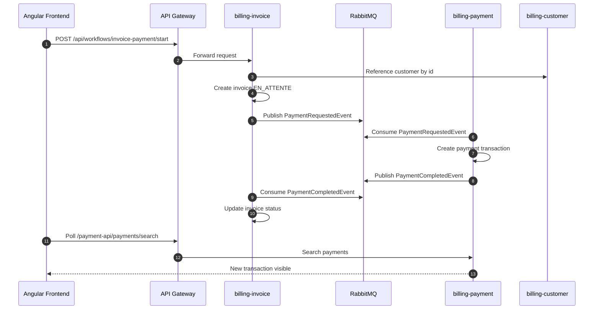

# Bank Transfer & Invoice Payment Management System

Plateforme microservices pour la gestion de factures, creanciers, points de vente, customers et paiements.

Le projet combine Spring Boot, Angular, RabbitMQ, Camunda, PostgreSQL, Vault, JasperReports, Apache Camel et une API Gateway.

## Architecture

```text
Angular Frontend
       |
       v
API Gateway :8085
       |
       +--> billing-invoice  :8080
       |      - factures
       |      - creanciers
       |      - points de vente
       |      - workflow Camunda
       |      - export PDF JasperReports
       |      - events RabbitMQ
       |
       +--> billing-payment  :8082
       |      - transactions payment
       |      - listener PaymentRequestedEvent
       |      - publisher PaymentCompletedEvent
       |
       +--> billing-customer :8083
              - referentiel customers

RabbitMQ
  - communication asynchrone invoice/payment

Vault
  - stockage centralise des secrets backend

PostgreSQL
  - schemas invoice, payment, customer
```

## Stack technique

- Frontend : Angular, Ng Zorro, RxJS.
- API Gateway : Spring Cloud Gateway.
- Backend : Spring Boot 3.5, Spring Data JPA, Spring Security Resource Server.
- Workflow : Camunda BPM.
- Messaging : RabbitMQ.
- Reporting : JasperReports.
- Integration : Apache Camel.
- Base de donnees : PostgreSQL.
- Secrets : HashiCorp Vault.
- Build : Maven, Maven Wrapper quand disponible, npm.

## Nouveautes ajoutees

### API Gateway

Un microservice `api-gateway` centralise maintenant les appels frontend.

Routes principales :

```text
/api/**          -> billing-invoice
/customer-api/** -> billing-customer
/payment-api/**  -> billing-payment
```

La gateway ecoute sur :

```text
http://localhost:8085
```

Le frontend Angular utilise cette gateway via `proxy.conf.json`.

### Vault

HashiCorp Vault a ete integre pour sortir les secrets des fichiers de configuration.

Objectifs :

- ne plus mettre les mots de passe en clair dans les `application.yaml` ;
- centraliser les secrets ;
- faciliter le changement de credentials sans modifier le code ;
- garder une configuration plus propre pour PostgreSQL, RabbitMQ et Keycloak.

Secrets attendus :

```text
DB_URL
DB_USERNAME
DB_PASSWORD
KEYCLOAK_ISSUER_URI
RABBITMQ_HOST
RABBITMQ_PORT
RABBITMQ_USERNAME
RABBITMQ_PASSWORD
```

Script de chargement :

```powershell
.\scripts\vault-put-secrets.ps1
```

Chemin Vault utilise :

```text
secret/application
```

### Frontend responsive

Le frontend Angular a ete ameliore pour mieux fonctionner sur desktop et mobile :

- sidebar desktop ;
- navigation mobile ;
- tableaux avec scroll horizontal controle ;
- colonnes longues mieux gerees ;
- meilleur affichage des dates, emails, ICE, references et montants ;
- layout plus stable sur petits ecrans.

### Dashboard

Une page dashboard a ete ajoutee comme page d'accueil.

Elle donne un acces rapide aux principales rubriques :

- factures ;
- creanciers ;
- points de vente ;
- test paiement ;
- transactions recentes.

### Factures

Ameliorations ajoutees :

- page liste des factures ;
- page detail facture `/factures/:id` ;
- endpoint backend `GET /api/invoices/{id}` ;
- affichage des vrais noms au lieu des IDs seuls :
  - customer ;
  - creancier ;
  - point de vente ;
- suivi simple de l'etat facture/paiement ;
- tri serveur ;
- pagination serveur ;
- etat de table conserve dans l'URL.

Exemple :

```text
/factures?page=2&size=20&sortBy=createdDate&sortOrder=descend
```

### Creanciers

Ameliorations ajoutees :

- CRUD complet ;
- recherche multi-criteres ;
- pagination serveur ;
- tri serveur ;
- notifications toast ;
- conservation de l'etat de table dans l'URL.

Colonnes triables :

- ID ;
- nom ;
- type ;
- ICE ;
- banque ;
- email ;
- telephone ;
- date creation.

### Points de vente

Ameliorations ajoutees :

- CRUD complet ;
- recherche multi-criteres ;
- export PDF ;
- pagination serveur ;
- tri serveur ;
- correction du backend pour respecter le parametre `size` ;
- notifications toast ;
- conservation de l'etat de table dans l'URL.

Colonnes triables :

- ID ;
- nom ;
- adresse ;
- telephone.

### Transactions payment

Ameliorations ajoutees :

- affichage des vrais noms customer, creancier et point de vente ;
- mode de paiement affiche correctement ;
- date creation affichee ;
- pagination serveur ;
- tri serveur ;
- conservation de l'etat de table dans l'URL.

Exemple :

```text
/test-paiement?paymentPage=2&paymentSize=20&paymentSortBy=amount&paymentSortOrder=descend
```

Colonnes triables :

- ID ;
- customer ;
- creancier ;
- point vente ;
- montant ;
- mode ;
- status ;
- date creation.

### Test paiement

La page de test paiement permet de declencher un workflow complet :

1. Creation d'une facture de test.
2. Selection d'un customer depuis le microservice `billing-customer`.
3. Selection d'un creancier.
4. Selection d'un point de vente.
5. Envoi d'un `PaymentRequestedEvent` via RabbitMQ.
6. Creation d'une transaction dans `billing-payment`.
7. Retour d'un `PaymentCompletedEvent`.
8. Mise a jour du statut facture.

Modes autorises :

```text
ESPECES
CARTE
```

## Flux paiement



## Ports par defaut

```text
api-gateway      : 8085
billing-invoice  : 8080
billing-payment  : 8082
billing-customer : 8083
RabbitMQ AMQP    : 5672
RabbitMQ UI      : 15672
Vault            : 8200
Angular frontend : 4200
```

## Demarrage rapide

### 1. Lancer l'infrastructure

RabbitMQ :

```bash
docker run -d --name rabbitmq -p 5672:5672 -p 15672:15672 rabbitmq:3-management
```

Vault :

```bash
docker compose up -d vault
```

Vault local :

```text
http://localhost:8200
token: root
```

Charger les secrets :

```powershell
$env:DB_URL="jdbc:postgresql://localhost:5432/billing"
$env:DB_USERNAME="postgres"
$env:DB_PASSWORD="postgres"
$env:KEYCLOAK_ISSUER_URI="http://localhost:8081/realms/billing"
$env:RABBITMQ_HOST="localhost"
$env:RABBITMQ_PORT="5672"
$env:RABBITMQ_USERNAME="guest"
$env:RABBITMQ_PASSWORD="guest"

.\scripts\vault-put-secrets.ps1
```

### 2. Demarrer les microservices

Depuis la racine du projet :

```powershell
cd billing-customer
mvn spring-boot:run
```

```powershell
cd ..\billing-payment
.\mvnw.cmd spring-boot:run
```

```powershell
cd ..\billing-invoice
.\mvnw.cmd spring-boot:run
```

```powershell
cd ..\api-gateway
.\mvnw.cmd spring-boot:run
```

### 3. Demarrer le frontend

Le frontend se trouve dans :

```text
C:\Users\a953702\projet_formation\front_bank\billing-invoice-frontend
```

Commandes :

```powershell
cd C:\Users\a953702\projet_formation\front_bank\billing-invoice-frontend
npm install
npm start
```

Application :

```text
http://localhost:4200
```

## Build et verification

Frontend :

```powershell
npm run build
```

Microservice invoice :

```powershell
cd billing-invoice
.\mvnw.cmd -q -DskipTests compile
```

Microservice payment :

```powershell
cd billing-payment
.\mvnw.cmd -q -DskipTests compile
```

API Gateway :

```powershell
cd api-gateway
.\mvnw.cmd -q -DskipTests compile
```

## Endpoints principaux

### Gateway

```text
GET http://localhost:8085/actuator/health
```

### Invoice

```text
GET  /api/invoices/search
GET  /api/invoices/{id}
GET  /api/invoices/{id}/export/pdf
POST /api/workflows/invoice-payment/start
GET  /api/creanciers/search
GET  /api/points-de-vente/search
```

### Customer

```text
GET /customer-api/customers/search
```

### Payment

```text
GET /payment-api/payments/search
GET /payment-api/payments/{id}
```

## Parametres de pagination et tri

Les endpoints de recherche acceptent :

```text
page
size
sortBy
sortDir
```

Exemple :

```text
/api/invoices/search?page=0&size=20&sortBy=createdDate&sortDir=desc
```

## Notes importantes

- Les customers doivent venir du microservice `billing-customer`.
- Les transactions doivent venir du microservice `billing-payment`.
- Les factures, creanciers et points de vente viennent du microservice `billing-invoice`.
- Le microservice payment ne doit pas utiliser une table customer locale comme source de verite.
- RabbitMQ peut rejouer des anciens messages si les queues ne sont pas videes ; en cas d'erreurs en boucle, verifier les messages en attente.
- Vault est utilise par les backends, pas directement par Angular.

## Licence

Projet de formation.
